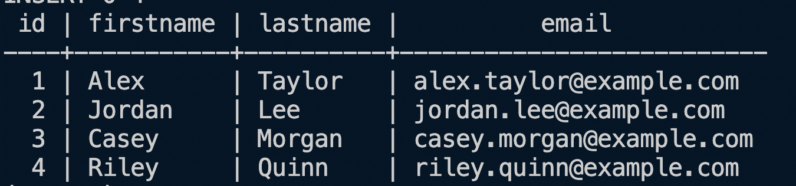
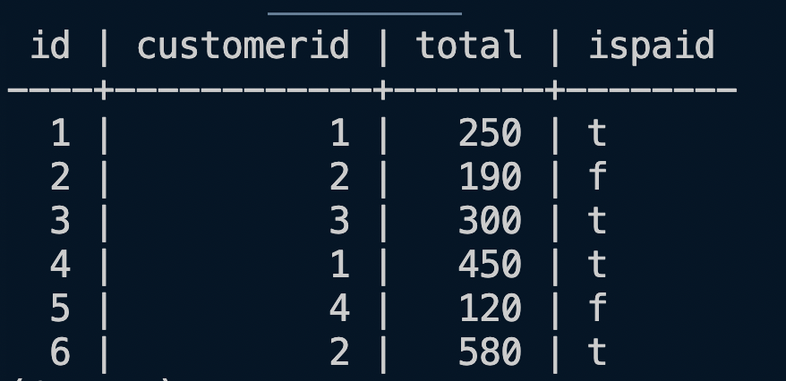

# Lab SQL Table Joins

This is an exercise in using PostgreSQL JOINS. Every question will be based on either a LEFT, RIGHT or INNER Join.

Given two tables, `customers` and `orders` in a `purchases` database, you will track certain data for your business based on the orders that have been made from your customers.

`Customers Table`

`Orders Table`

## Getting Started

In the terminal run the following commands:

- `fork` and `clone` this repository
- `cd` into to directory
- `ls` make sure you see the file regifter.sql
- `psql`
- `\i customers.sql` to run the file customers.sql

## Instructions

You will write a query between the `--` lines for each echo that is given.

To test a query, each time, run `\i customers.sql` in the psql part of the terminal either in VSCode or in your iTerm. Not both. Make sure your Postgres app is running.

Remember, each time that you run the above command you are recreating the database and the tables and re-running all the queries.

If you feel your terminal is too crowded when testing, feel free to comment out the previous problems.

**DO NOT** comment out the statements and solutions in the sql file that sit between `Getting started, do not update` and `\echo - Find all orders, including the firstname, lastname and email of the customer who made each order.`

Good Luck!
